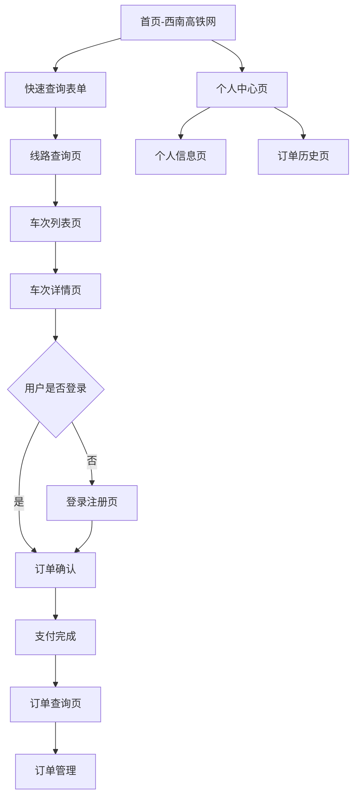

# 铁路12306系统产品需求文档

## 1. 产品概述

铁路12306系统是一个专业的火车票预订和管理平台，模拟中国铁路客户服务中心官网功能。系统为用户提供便捷的车票查询、预订、支付和管理服务，旨在简化火车票购买流程，提升用户出行体验。

## 2. 核心功能

### 2.1 用户角色

| 角色   | 注册方式  | 核心权限        |
| ---- | ----- | ----------- |
| 普通用户 | 手机号/邮箱注册  | 查询车次、购买车票、管理订单、个人信息管理 |
| 管理员 | 系统分配账号 | 系统管理、用户管理、车次管理、订单管理 |

### 2.2 功能模块

我们的铁路12306系统包括以下主要页面：

1. 首页：12306高铁网品牌展示、轮播图、导航菜单、快速查询入口
2. 线路查询页：车次搜索、查询条件设置、线路信息展示
3. 车次详情页：具体车次信息、座位类型、价格展示、购票操作
4. 车次列表页：查询结果展示、车次筛选、余票信息
5. 订单查询页：订单状态查看、订单管理、支付状态
6. 个人中心页：用户信息管理、账户设置
7. 个人中心页（订单历史）：历史订单查看、出行记录
8. 个人中心页（个人信息）：用户资料编辑、身份认证

### 2.3 页面详情

| 页面名称 | 模块名称  | 功能描述        |
| ---- | ----- | ----------- |
| 首页 | 顶部导航 | 提供主要功能入口，包括车次查询、订单管理、个人中心、登录注册 |
| 首页 | 轮播展示区 | 自动轮播高铁宣传图片，展示西南高铁网品牌形象 |
| 首页 | 快速查询表单 | 输入出发地、目的地、出发日期、返程日期进行车次查询 |
| 首页 | 功能导航区 | 提供订票、改签、退票、时刻表查询等快捷入口 |
| 线路查询页 | 查询条件设置 | 设置出发地、目的地、出发时间等查询条件 |
| 线路查询页 | 线路信息展示 | 显示查询到的线路基本信息和运行时间 |
| 车次详情页 | 车次基本信息 | 显示车次号、运行时间、停靠站点等详细信息 |
| 车次详情页 | 座位类型选择 | 选择商务座、一等座、二等座等不同座位类型 |
| 车次详情页 | 价格信息展示 | 显示不同座位类型的票价信息 |
| 车次列表页 | 查询结果列表 | 显示符合条件的所有车次，包括时间、价格、余票状态 |
| 车次列表页 | 筛选功能 | 根据出发时间、车次类型、座位类型等条件筛选 |
| 车次列表页 | 余票信息 | 实时显示各座位类型的余票数量 |
| 订单查询页 | 订单列表展示 | 显示用户所有订单的状态、车次、时间等基本信息 |
| 订单查询页 | 订单状态管理 | 支持查看订单详情、取消订单、申请退票等操作 |
| 订单查询页 | 支付状态跟踪 | 显示订单支付状态，支持继续支付未完成订单 |
| 个人中心页 | 用户信息展示 | 显示用户基本信息、账户状态、会员等级 |
| 个人中心页 | 账户设置 | 修改密码、绑定手机号、邮箱验证等安全设置 |
| 个人中心页（订单历史） | 历史订单查看 | 查看所有历史购票记录，支持按时间、状态筛选 |
| 个人中心页（订单历史） | 出行记录统计 | 统计用户出行次数、常用线路等信息 |
| 个人中心页（个人信息） | 基本信息编辑 | 编辑姓名、身份证号、联系方式等个人信息 |
| 个人中心页（个人信息） | 身份认证管理 | 上传身份证照片、进行实名认证验证 |

## 3. 核心流程

### 用户购票流程
1. 用户访问首页（西南高铁网），浏览轮播图和功能导航
2. 用户在快速查询表单中输入出发地、目的地和出发日期
3. 系统跳转到线路查询页面，显示查询条件和线路信息
4. 用户进入车次列表页面，查看所有符合条件的车次
5. 用户选择具体车次，进入车次详情页面查看详细信息
6. 用户选择座位类型，查看价格信息，点击购票
7. 系统引导用户登录（如未登录）
8. 用户填写乘客信息，确认订单
9. 用户完成支付，订单生成成功

### 用户管理流程
1. 用户通过顶部导航进入登录注册页面
2. 新用户完成注册，老用户直接登录
3. 用户进入个人中心页面，查看账户信息
4. 用户可在个人信息页面编辑基本资料和身份认证
5. 用户可在订单历史页面查看所有购票记录
6. 用户可在订单查询页面管理当前订单状态

### 订单管理流程
1. 用户在订单查询页面查看所有订单状态
2. 用户可查看订单详情，包括车次信息和支付状态
3. 用户可对未支付订单继续支付
4. 用户可申请退票或改签（根据订单状态）
5. 系统实时更新订单状态和支付信息

## 4. 用户界面设计

### 4.1 设计风格

* 主色调：蓝色系（#0066CC）体现铁路官方权威性和专业性
* 辅助色：橙色（#FF6600）用于重要按钮和操作提示
* 背景色：浅蓝色渐变（#E6F3FF到#FFFFFF）营造清新感
* 按钮风格：圆角矩形，渐变效果，悬停状态明显变化
* 字体：微软雅黑，标题18px，正文14px，说明文字12px
* 布局风格：现代扁平化设计，清晰的信息层次，适当的阴影效果
* 图标风格：线性图标配合填充图标，简洁现代，高铁主题元素

### 4.2 页面设计总览

| 页面名称 | 模块名称  | UI 元素             |
| ---- | ----- | ----------------- |
| 首页 | 顶部导航栏 | 深蓝色背景，白色文字，西南高铁网Logo，用户登录入口 |
| 首页 | 轮播展示区 | 全屏轮播图，高铁主题图片，自动切换，指示器导航 |
| 首页 | 快速查询区 | 白色半透明背景，蓝色边框，橙色查询按钮，城市选择下拉框 |
| 首页 | 功能导航区 | 网格布局，图标+文字，悬停放大效果，蓝色主题 |
| 线路查询页 | 查询条件区 | 顶部固定，白色背景，条件标签，修改按钮 |
| 线路查询页 | 线路信息区 | 卡片式布局，线路图展示，时间轴设计 |
| 车次详情页 | 车次信息区 | 大标题显示，时间突出，站点列表，运行图 |
| 车次详情页 | 座位选择区 | 座位图标，价格标签，余票数量，选择按钮 |
| 车次列表页 | 筛选工具栏 | 水平布局，标签式筛选，时间段选择，车型筛选 |
| 车次列表页 | 车次列表区 | 表格布局，交替背景色，余票状态颜色编码，预订按钮 |
| 订单查询页 | 订单列表区 | 卡片式订单，状态标签，操作按钮组，分页导航 |
| 订单查询页 | 订单详情区 | 展开式设计，详细信息表格，支付状态图标 |
| 个人中心页 | 左侧导航区 | 垂直菜单，用户头像，当前页高亮，图标导航 |
| 个人中心页 | 内容展示区 | 右侧主内容，表单布局，数据统计卡片 |
| 个人中心页（订单历史） | 历史记录区 | 时间轴布局，订单卡片，筛选条件，统计图表 |
| 个人中心页（个人信息） | 信息编辑区 | 表单布局，头像上传，验证提示，保存按钮 |

### 4.3 响应式设计

系统采用**桌面优先**的响应式设计策略：
* 主要针对桌面端用户体验优化（1200px以上屏幕）
* 支持平板设备访问（768px-1199px），导航栏自适应
* 基础移动端兼容（320px-767px），简化功能布局
* 关键操作支持触控优化，按钮尺寸不小于44px
* 轮播图在移动端自动调整高度和内容显示

## 5. 技术需求

### 5.1 功能性需求

**用户认证模块：**
- 支持手机号和邮箱两种注册方式
- 密码强度验证（至少8位，包含字母和数字）
- 图形验证码和短信验证码验证
- 登录失败次数限制和账户锁定机制
- 用户会话管理和自动登录功能

**车票查询模块：**
- 城市车站名称模糊搜索功能
- 日期选择限制（当前日期起30天内）
- 多条件筛选（车次类型、时间段、席别等）
- 车次信息实时展示和排序功能
- 余票数量实时查询和更新

**订单管理模块：**
- 常用乘车人信息管理（最多15人）
- 订单信息验证和重复提交防护
- 订单状态跟踪（待支付、已支付、已取消、已完成）
- 支付超时自动取消机制
- 订单历史查询和分页展示

### 5.2 非功能性需求

**性能要求：**
- 页面首次加载时间 < 3秒
- 车票查询响应时间 < 2秒
- 系统支持并发用户数 ≥ 100人
- 数据库查询优化，索引合理设计

**安全要求：**
- 用户密码MD5/SHA256加密存储
- 敏感数据传输HTTPS加密
- SQL注入和XSS攻击防护
- 用户输入数据验证和过滤
- 登录失败次数限制和IP限制

**可用性要求：**
- 界面简洁直观，操作流程清晰
- 错误提示信息准确明确
- 支持主流浏览器（Chrome、Firefox、Safari、Edge）
- 关键操作提供确认机制

### 5.3 数据要求

**数据完整性：**
- 用户信息和乘客信息完整性验证
- 车次信息和余票数据一致性保证
- 订单数据完整性和状态一致性

**数据安全性：**
- 用户敏感信息加密存储
- 数据备份和恢复机制
- 操作日志记录和审计

## 6. 验收标准

### 6.1 功能验收

**用户注册登录：**
- ✅ 用户可以通过手机号或邮箱成功注册
- ✅ 密码强度验证正常工作
- ✅ 验证码发送和验证功能正常
- ✅ 登录状态保持和自动登录功能正常
- ✅ 登录失败锁定机制正常工作

**车票查询：**
- ✅ 城市搜索和选择功能正常
- ✅ 日期选择限制正确执行
- ✅ 车次列表正确展示和筛选
- ✅ 余票信息实时准确显示
- ✅ 排序功能正常工作

**订单处理：**
- ✅ 乘客信息选择和验证正常
- ✅ 订单信息计算准确
- ✅ 订单提交和状态更新正常
- ✅ 支付流程模拟正常
- ✅ 订单管理功能完整

### 6.2 性能验收

- ✅ 页面加载时间符合要求
- ✅ 查询响应时间符合要求
- ✅ 并发用户测试通过
- ✅ 数据库性能测试通过

### 6.3 安全验收

- ✅ 密码加密存储验证
- ✅ 输入验证和过滤测试
- ✅ SQL注入防护测试
- ✅ XSS攻击防护测试
- ✅ 会话安全测试

## 7. 项目里程碑

### 7.1 开发阶段

**第一阶段（基础功能）：**
- 用户注册登录功能
- 基础车票查询功能
- 数据库设计和基础数据

**第二阶段（核心功能）：**
- 车次列表展示和筛选
- 订单填写和提交功能
- 用户会话管理

**第三阶段（完善功能）：**
- 个人中心和用户管理
- 订单管理和状态跟踪
- 乘客信息管理

**第四阶段（优化完善）：**
- 性能优化和安全加固
- 用户体验优化
- 测试和bug修复

### 7.2 测试阶段

- 单元测试和集成测试
- 功能测试和性能测试
- 安全测试和兼容性测试
- 用户验收测试

## 8. 风险评估

### 8.1 技术风险

- **数据库性能风险**：大量并发查询可能影响响应速度
- **前端兼容性风险**：不同浏览器可能存在兼容性问题
- **安全风险**：用户数据和支付信息需要严格保护

### 8.2 项目风险

- **开发进度风险**：功能复杂度可能影响开发进度
- **需求变更风险**：需求理解偏差可能导致返工
- **测试风险**：测试覆盖不足可能影响系统质量

### 8.3 风险应对

- 采用分阶段开发，优先实现核心功能
- 建立完善的测试体系，确保代码质量
- 定期进行安全审计和性能测试
- 保持与需求方的密切沟通

---

**文档版本**：v2.0  
**编写日期**：2025年1月  
**文档状态**：已完成  
**审核状态**：待审核