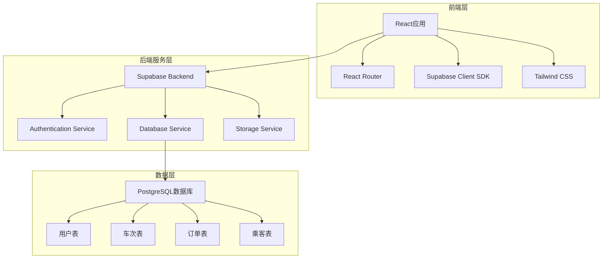
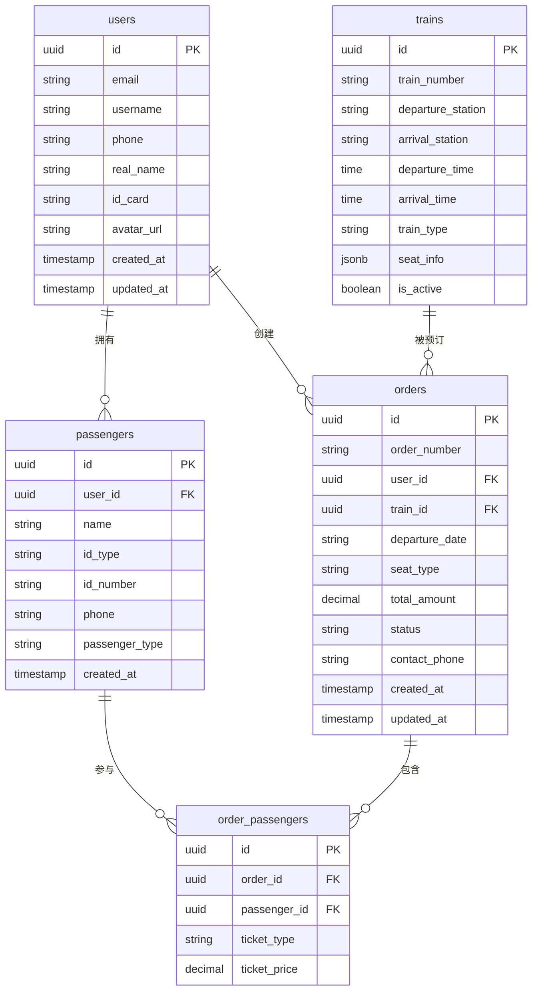

# 铁路12306系统技术架构文档

## 1. 架构设计



## 2. 技术描述

**前端技术栈：**
- React@18 - 用户界面构建
- React Router@6 - 前端路由管理
- Tailwind CSS@3 - 样式框架
- Vite@4 - 构建工具
- Supabase Client SDK - 数据库和认证客户端

**后端技术栈：**
- Supabase - 后端即服务平台
- PostgreSQL - 关系型数据库
- Row Level Security - 数据安全策略

**开发工具：**
- TypeScript - 类型安全
- ESLint - 代码规范
- Prettier - 代码格式化

## 3. 路由定义

| 路由 | 用途 | 组件 |
|------|------|------|
| / | 首页（西南高铁网），展示轮播图、导航菜单和快速查询表单 | HomePage |
| /route-search | 线路查询页，显示查询条件和线路信息 | RouteSearchPage |
| /train-list | 车次列表页，显示查询结果、筛选功能和余票信息 | TrainListPage |
| /train-detail/:id | 车次详情页，显示具体车次信息、座位类型和价格 | TrainDetailPage |
| /order-query | 订单查询页，用户订单状态查看和管理 | OrderQueryPage |
| /login | 登录页，用户身份验证 | LoginPage |
| /register | 注册页，新用户账户创建 | RegisterPage |
| /profile | 个人中心页，用户信息展示和账户设置 | ProfilePage |
| /profile/orders | 个人中心-订单历史页，历史订单查看和出行记录 | OrdersPage |
| /profile/info | 个人中心-个人信息页，用户资料编辑和身份认证 | UserInfoPage |

## 4. API 定义

### 4.1 认证相关 API

**用户注册：**
```typescript
// Supabase Auth API
const { data, error } = await supabase.auth.signUp({
  email: string,
  password: string,
  options: {
    data: {
      username: string,
      phone: string
    }
  }
})
```

**用户登录：**
```typescript
// Supabase Auth API
const { data, error } = await supabase.auth.signInWithPassword({
  email: string,
  password: string
})
```

### 4.2 数据查询 API

**车次查询：**
```typescript
// 查询车次信息
const { data, error } = await supabase
  .from('trains')
  .select('*')
  .eq('departure_station', departureStation)
  .eq('arrival_station', arrivalStation)
  .eq('departure_date', departureDate)
```

**订单创建：**
```typescript
// 创建新订单
const { data, error } = await supabase
  .from('orders')
  .insert({
    user_id: userId,
    train_id: trainId,
    passengers: passengerIds,
    total_amount: totalAmount,
    status: 'pending'
  })
```

### 4.3 核心数据类型

```typescript
// 用户信息类型
interface User {
  id: string;
  email: string;
  username: string;
  phone: string;
  real_name?: string;
  id_card?: string;
  avatar_url?: string;
  created_at: string;
}

// 车次信息类型
interface Train {
  id: string;
  train_number: string;
  departure_station: string;
  arrival_station: string;
  departure_time: string;
  arrival_time: string;
  departure_date: string;
  duration: string;
  train_type: 'high_speed' | 'bullet' | 'normal';
  seats: SeatInfo[];
}

// 座位信息类型
interface SeatInfo {
  seat_type: 'business' | 'first_class' | 'second_class' | 'hard_seat' | 'soft_sleeper' | 'hard_sleeper';
  available_count: number;
  price: number;
}

// 乘客信息类型
interface Passenger {
  id: string;
  user_id: string;
  name: string;
  id_type: 'id_card' | 'passport' | 'other';
  id_number: string;
  phone: string;
  passenger_type: 'adult' | 'child' | 'student';
}

// 订单信息类型
interface Order {
  id: string;
  order_number: string;
  user_id: string;
  train_id: string;
  passengers: string[];
  seat_type: string;
  total_amount: number;
  status: 'pending' | 'paid' | 'cancelled' | 'completed';
  contact_phone: string;
  created_at: string;
  updated_at: string;
}
```

## 5. 数据模型

### 5.1 数据模型定义



### 5.2 DDL 语句

```sql
-- 启用UUID扩展
CREATE EXTENSION IF NOT EXISTS "uuid-ossp";

-- 用户表（Supabase自动创建auth.users，这里创建扩展信息表）
CREATE TABLE public.user_profiles (
    id UUID REFERENCES auth.users(id) PRIMARY KEY,
    username VARCHAR(50) UNIQUE NOT NULL,
    phone VARCHAR(20) UNIQUE,
    real_name VARCHAR(100),
    id_card VARCHAR(20),
    avatar_url TEXT,
    is_verified BOOLEAN DEFAULT FALSE,
    member_level VARCHAR(20) DEFAULT 'normal',
    created_at TIMESTAMP WITH TIME ZONE DEFAULT NOW(),
    updated_at TIMESTAMP WITH TIME ZONE DEFAULT NOW()
);

-- 车站表
CREATE TABLE public.stations (
    id UUID DEFAULT uuid_generate_v4() PRIMARY KEY,
    station_code VARCHAR(10) UNIQUE NOT NULL,
    station_name VARCHAR(50) NOT NULL,
    city VARCHAR(50) NOT NULL,
    province VARCHAR(50) NOT NULL,
    pinyin VARCHAR(100),
    is_active BOOLEAN DEFAULT TRUE,
    created_at TIMESTAMP WITH TIME ZONE DEFAULT NOW()
);

-- 线路表
CREATE TABLE public.routes (
    id UUID DEFAULT uuid_generate_v4() PRIMARY KEY,
    route_name VARCHAR(100) NOT NULL,
    departure_station_id UUID REFERENCES public.stations(id) NOT NULL,
    arrival_station_id UUID REFERENCES public.stations(id) NOT NULL,
    distance INTEGER,
    estimated_duration INTEGER,
    is_active BOOLEAN DEFAULT TRUE,
    created_at TIMESTAMP WITH TIME ZONE DEFAULT NOW()
);

-- 车次表
CREATE TABLE public.trains (
    id UUID DEFAULT uuid_generate_v4() PRIMARY KEY,
    train_number VARCHAR(20) NOT NULL UNIQUE,
    train_type VARCHAR(10) NOT NULL, -- G(高铁), D(动车), C(城际), K(快速)
    route_id UUID REFERENCES public.routes(id) NOT NULL,
    departure_time TIME NOT NULL,
    arrival_time TIME NOT NULL,
    duration INTEGER NOT NULL,
    seat_info JSONB NOT NULL,
    is_active BOOLEAN DEFAULT true,
    created_at TIMESTAMP WITH TIME ZONE DEFAULT NOW()
);

-- 车次停靠站表
CREATE TABLE public.train_stops (
    id UUID DEFAULT uuid_generate_v4() PRIMARY KEY,
    train_id UUID REFERENCES public.trains(id) ON DELETE CASCADE,
    station_id UUID REFERENCES public.stations(id) NOT NULL,
    stop_order INTEGER NOT NULL,
    arrival_time TIME,
    departure_time TIME,
    stop_duration INTEGER DEFAULT 0,
    created_at TIMESTAMP WITH TIME ZONE DEFAULT NOW()
);

-- 座位类型表
CREATE TABLE public.seat_types (
    id UUID DEFAULT uuid_generate_v4() PRIMARY KEY,
    type_name VARCHAR(20) NOT NULL, -- 商务座, 一等座, 二等座, 硬卧, 软卧
    type_code VARCHAR(10) NOT NULL,
    comfort_level INTEGER DEFAULT 1,
    price_multiplier DECIMAL(3,2) DEFAULT 1.00,
    created_at TIMESTAMP WITH TIME ZONE DEFAULT NOW()
);

-- 每日车次座位表（动态库存）
CREATE TABLE public.daily_train_seats (
    id UUID DEFAULT uuid_generate_v4() PRIMARY KEY,
    train_id UUID REFERENCES public.trains(id) NOT NULL,
    seat_type_id UUID REFERENCES public.seat_types(id) NOT NULL,
    travel_date DATE NOT NULL,
    available_seats INTEGER NOT NULL,
    total_seats INTEGER NOT NULL,
    current_price DECIMAL(10,2) NOT NULL,
    created_at TIMESTAMP WITH TIME ZONE DEFAULT NOW(),
    updated_at TIMESTAMP WITH TIME ZONE DEFAULT NOW(),
    UNIQUE(train_id, seat_type_id, travel_date)
);

-- 乘客表
CREATE TABLE public.passengers (
    id UUID DEFAULT uuid_generate_v4() PRIMARY KEY,
    user_id UUID REFERENCES auth.users(id) ON DELETE CASCADE,
    name VARCHAR(100) NOT NULL,
    id_type VARCHAR(20) NOT NULL DEFAULT 'id_card',
    id_number VARCHAR(30) NOT NULL,
    phone VARCHAR(20),
    passenger_type VARCHAR(20) NOT NULL DEFAULT 'adult',
    created_at TIMESTAMP WITH TIME ZONE DEFAULT NOW()
);

-- 订单表
CREATE TABLE public.orders (
    id UUID DEFAULT uuid_generate_v4() PRIMARY KEY,
    order_number VARCHAR(50) NOT NULL UNIQUE,
    user_id UUID REFERENCES auth.users(id) ON DELETE CASCADE,
    train_id UUID REFERENCES public.trains(id),
    departure_station_id UUID REFERENCES public.stations(id) NOT NULL,
    arrival_station_id UUID REFERENCES public.stations(id) NOT NULL,
    departure_date DATE NOT NULL,
    seat_type VARCHAR(20) NOT NULL,
    total_amount DECIMAL(10,2) NOT NULL,
    status VARCHAR(20) NOT NULL DEFAULT 'pending',
    contact_phone VARCHAR(20) NOT NULL,
    booking_time TIMESTAMP WITH TIME ZONE DEFAULT NOW(),
    payment_deadline TIMESTAMP WITH TIME ZONE,
    created_at TIMESTAMP WITH TIME ZONE DEFAULT NOW(),
    updated_at TIMESTAMP WITH TIME ZONE DEFAULT NOW()
);

-- 订单乘客关联表
CREATE TABLE public.order_passengers (
    id UUID DEFAULT uuid_generate_v4() PRIMARY KEY,
    order_id UUID REFERENCES public.orders(id) ON DELETE CASCADE,
    passenger_id UUID REFERENCES public.passengers(id),
    seat_number VARCHAR(10),
    ticket_type VARCHAR(20) NOT NULL DEFAULT 'adult',
    ticket_price DECIMAL(8,2) NOT NULL
);

-- 支付记录表
CREATE TABLE public.payments (
    id UUID DEFAULT uuid_generate_v4() PRIMARY KEY,
    order_id UUID REFERENCES public.orders(id) ON DELETE CASCADE,
    payment_method VARCHAR(20) NOT NULL, -- alipay, wechat, bank_card
    amount DECIMAL(10,2) NOT NULL,
    status VARCHAR(20) DEFAULT 'pending', -- pending, success, failed, refunded
    transaction_id VARCHAR(100),
    payment_time TIMESTAMP WITH TIME ZONE,
    refund_time TIMESTAMP WITH TIME ZONE,
    refund_amount DECIMAL(10,2),
    created_at TIMESTAMP WITH TIME ZONE DEFAULT NOW()
);

-- 用户出行统计表
CREATE TABLE public.user_travel_stats (
    id UUID DEFAULT uuid_generate_v4() PRIMARY KEY,
    user_id UUID REFERENCES auth.users(id) ON DELETE CASCADE,
    total_trips INTEGER DEFAULT 0,
    total_distance INTEGER DEFAULT 0,
    favorite_route_id UUID REFERENCES public.routes(id),
    last_travel_date DATE,
    created_at TIMESTAMP WITH TIME ZONE DEFAULT NOW(),
    updated_at TIMESTAMP WITH TIME ZONE DEFAULT NOW(),
    UNIQUE(user_id)
);

-- 创建索引
CREATE INDEX idx_passengers_user_id ON public.passengers(user_id);
CREATE INDEX idx_orders_user_id ON public.orders(user_id);
CREATE INDEX idx_orders_status ON public.orders(status);
CREATE INDEX idx_trains_route ON public.trains(route_id);
CREATE INDEX idx_train_stops_train_id ON public.train_stops(train_id);
CREATE INDEX idx_daily_train_seats_date ON public.daily_train_seats(travel_date);
CREATE INDEX idx_order_passengers_order_id ON public.order_passengers(order_id);
CREATE INDEX idx_payments_order_id ON public.payments(order_id);
CREATE INDEX idx_stations_city ON public.stations(city);
CREATE INDEX idx_routes_stations ON public.routes(departure_station_id, arrival_station_id);

-- 设置RLS策略
ALTER TABLE public.user_profiles ENABLE ROW LEVEL SECURITY;
ALTER TABLE public.passengers ENABLE ROW LEVEL SECURITY;
ALTER TABLE public.orders ENABLE ROW LEVEL SECURITY;
ALTER TABLE public.order_passengers ENABLE ROW LEVEL SECURITY;
ALTER TABLE public.payments ENABLE ROW LEVEL SECURITY;
ALTER TABLE public.user_travel_stats ENABLE ROW LEVEL SECURITY;

-- 用户只能访问自己的数据
CREATE POLICY "Users can view own profile" ON public.user_profiles
    FOR SELECT USING (auth.uid() = id);

CREATE POLICY "Users can update own profile" ON public.user_profiles
    FOR UPDATE USING (auth.uid() = id);

CREATE POLICY "Users can view own passengers" ON public.passengers
    FOR ALL USING (auth.uid() = user_id);

CREATE POLICY "Users can view own orders" ON public.orders
    FOR ALL USING (auth.uid() = user_id);

CREATE POLICY "Users can view own payments" ON public.payments
    FOR SELECT USING (auth.uid() IN (SELECT user_id FROM public.orders WHERE id = order_id));

CREATE POLICY "Users can view own travel stats" ON public.user_travel_stats
    FOR ALL USING (auth.uid() = user_id);

-- 公共数据对所有用户可见
CREATE POLICY "Stations are viewable by everyone" ON public.stations
    FOR SELECT USING (true);

CREATE POLICY "Routes are viewable by everyone" ON public.routes
    FOR SELECT USING (true);

CREATE POLICY "Trains are viewable by everyone" ON public.trains
    FOR SELECT USING (true);

CREATE POLICY "Train stops are viewable by everyone" ON public.train_stops
    FOR SELECT USING (true);

CREATE POLICY "Seat types are viewable by everyone" ON public.seat_types
    FOR SELECT USING (true);

CREATE POLICY "Daily train seats are viewable by everyone" ON public.daily_train_seats
    FOR SELECT USING (true);

-- 授权
GRANT SELECT ON public.stations TO anon;
GRANT SELECT ON public.routes TO anon;
GRANT SELECT ON public.trains TO anon;
GRANT SELECT ON public.train_stops TO anon;
GRANT SELECT ON public.seat_types TO anon;
GRANT SELECT ON public.daily_train_seats TO anon;
GRANT ALL PRIVILEGES ON public.user_profiles TO authenticated;
GRANT ALL PRIVILEGES ON public.passengers TO authenticated;
GRANT ALL PRIVILEGES ON public.orders TO authenticated;
GRANT ALL PRIVILEGES ON public.order_passengers TO authenticated;
GRANT ALL PRIVILEGES ON public.payments TO authenticated;
GRANT ALL PRIVILEGES ON public.user_travel_stats TO authenticated;
GRANT UPDATE ON public.daily_train_seats TO authenticated;
```

### 5.3 初始化数据

```sql
-- 插入示例车次数据
INSERT INTO public.trains (train_number, departure_station, arrival_station, departure_time, arrival_time, train_type, seat_info) VALUES
('G1001', '北京南', '上海虹桥', '08:00:00', '12:30:00', 'high_speed', 
 '{"business": {"count": 50, "price": 933}, "first_class": {"count": 100, "price": 553}, "second_class": {"count": 200, "price": 333}}'),
('G1002', '上海虹桥', '北京南', '09:00:00', '13:30:00', 'high_speed',
 '{"business": {"count": 50, "price": 933}, "first_class": {"count": 100, "price": 553}, "second_class": {"count": 200, "price": 333}}'),
('D3001', '广州南', '深圳北', '07:30:00', '08:30:00', 'bullet',
 '{"first_class": {"count": 80, "price": 79}, "second_class": {"count": 150, "price": 47}}'),
('K1001', '北京', '西安', '20:00:00', '08:30:00', 'normal',
 '{"hard_seat": {"count": 200, "price": 152}, "soft_sleeper": {"count": 60, "price": 312}, "hard_sleeper": {"count": 100, "price": 212}}');

-- 插入更多车次数据以供测试
INSERT INTO public.trains (train_number, departure_station, arrival_station, departure_time, arrival_time, train_type, seat_info) VALUES
('G1003', '北京南', '天津南', '06:30:00', '07:00:00', 'high_speed',
 '{"business": {"count": 30, "price": 99}, "first_class": {"count": 60, "price": 65}, "second_class": {"count": 120, "price": 54}}'),
('G1004', '天津南', '北京南', '18:00:00', '18:30:00', 'high_speed',
 '{"business": {"count": 30, "price": 99}, "first_class": {"count": 60, "price": 65}, "second_class": {"count": 120, "price": 54}}'),
('D2001', '杭州东', '宁波', '09:15:00', '11:45:00', 'bullet',
 '{"first_class": {"count": 70, "price": 98}, "second_class": {"count": 140, "price": 62}}'),
('K2001', '成都', '重庆北', '22:30:00', '05:30:00', 'normal',
 '{"hard_seat": {"count": 180, "price": 46}, "soft_sleeper": {"count": 50, "price": 156}, "hard_sleeper": {"count": 80, "price": 96}}');
```

## 6. 安全策略

### 6.1 认证安全

- 使用Supabase内置认证系统
- 密码强度验证（最少8位，包含字母数字）
- 邮箱验证和手机验证
- JWT Token自动管理
- 会话超时自动登出

### 6.2 数据安全

- Row Level Security (RLS) 策略
- 用户只能访问自己的数据
- 敏感信息加密存储
- SQL注入防护
- XSS攻击防护

### 6.3 API安全

- 所有API请求需要认证
- 请求频率限制
- 输入数据验证和清理
- HTTPS强制加密传输

## 7. 部署架构

### 7.1 开发环境

```bash
# 安装依赖
npm install

# 启动开发服务器
npm run dev

# 构建生产版本
npm run build
```

### 7.2 生产环境

- **前端部署**：Vercel/Netlify静态托管
- **后端服务**：Supabase云服务
- **数据库**：Supabase PostgreSQL
- **CDN**：自动配置
- **域名**：自定义域名配置

### 7.3 环境变量

```env
# Supabase配置
VITE_SUPABASE_URL=your_supabase_url
VITE_SUPABASE_ANON_KEY=your_supabase_anon_key

# 应用配置
VITE_APP_NAME=铁路12306系统
VITE_APP_VERSION=1.0.0
```

## 8. 性能优化

### 8.1 前端优化

- React组件懒加载
- 图片懒加载和压缩
- 代码分割和Tree Shaking
- 缓存策略优化
- 虚拟滚动（长列表）

### 8.2 数据库优化

- 合理的索引设计
- 查询语句优化
- 分页查询实现
- 连接池配置
- 缓存热点数据

### 8.3 网络优化

- HTTP/2支持
- Gzip压缩
- 静态资源CDN
- API响应缓存
- 请求合并优化

## 9. 监控和日志

### 9.1 应用监控

- Supabase内置监控面板
- 错误日志收集
- 性能指标监控
- 用户行为分析

### 9.2 数据库监控

- 查询性能监控
- 连接数监控
- 存储空间监控
- 慢查询分析

---

**文档版本**：v1.0  
**编写日期**：2025年1月  
**文档状态**：已完成  
**技术负责人**：开发团队